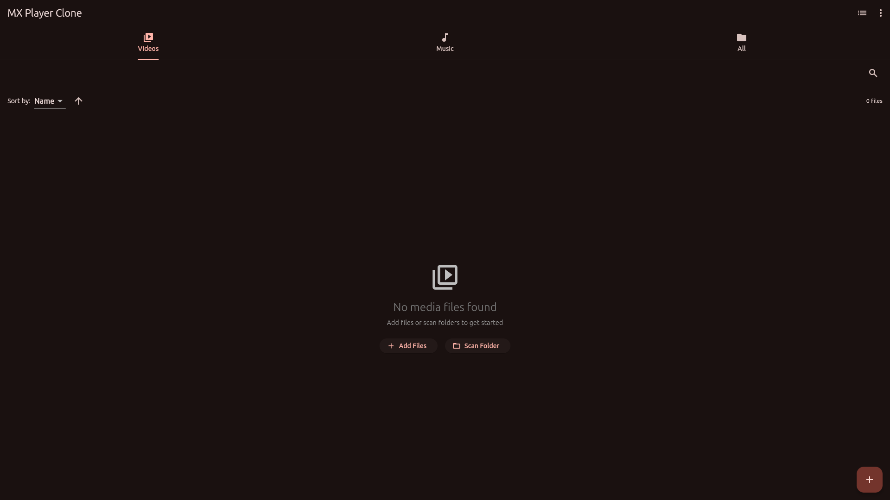
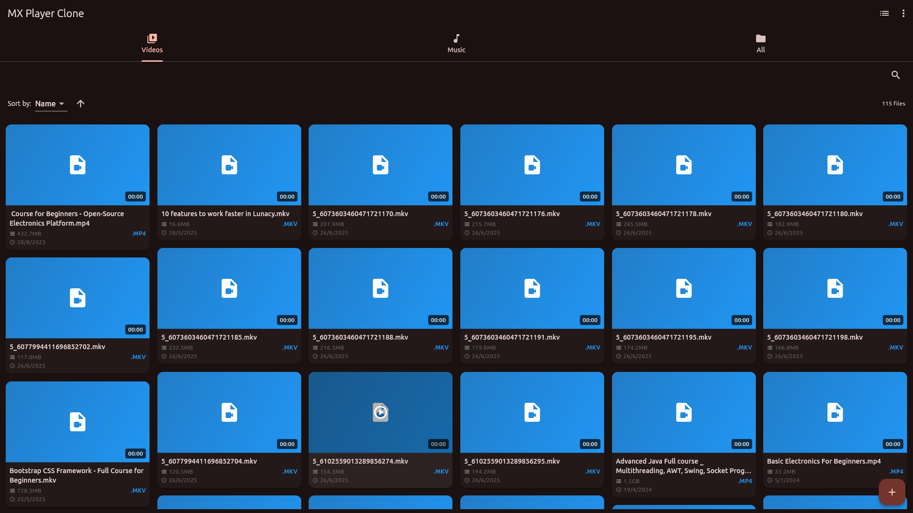
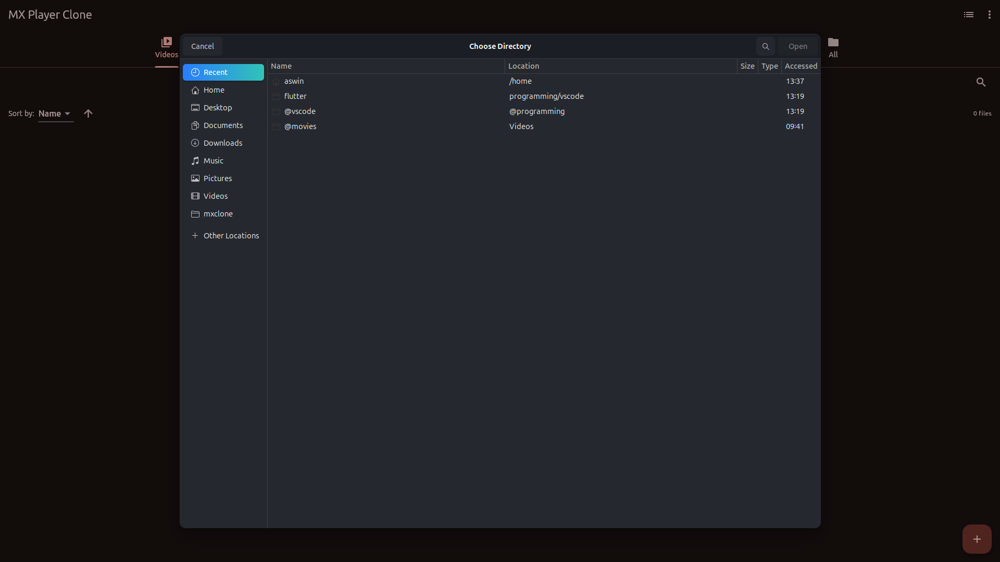
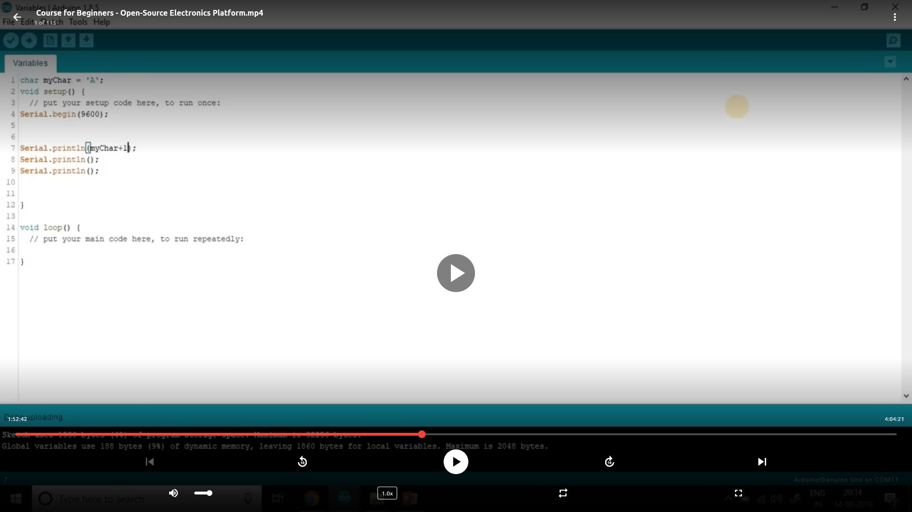

# MX Clone (Linux)

An open‑source, Linux‑first media player inspired by MX Player. Built with Flutter and media_kit, featuring a clean UI, playlists, and smooth local playback.

## Table of Contents
1. Features
2. Screenshots
3. Installation (Linux)
4. Usage
5. Dependencies
6. Project Structure
7. Troubleshooting
8. Development
9. Contributing
10. License

## 1) Features
- **Local media browsing**: Scan folders or pick files; supports common video and audio formats.
- **Fast search & filtering**: Filter by type (Videos, Music, All) and search by name.
- **Grid/List views**: Toggle between masonry grid and list.
- **Playback controls**: Play/Pause, seek ±10s, volume, mute, playback speed, repeat modes, fullscreen.
- **Progress & resume**: Saves last played position and restores when reopening a file.
- **Playlists (basic)**: Create playlists and queue items from the current selection.
- **Keyboard/Mouse friendly**: Desktop‑optimized interactions and dialogs.

## 2) Screenshots

> The following screenshots are included in the repository under `assets/screenshot/`.

- Home

  

- Available Videos

  

- Add Folders

  

- Video Playing

  

## 3) Installation (Linux)

Prerequisites:
- Flutter (latest stable)
- A working desktop portal for file dialogs: `xdg-desktop-portal` and a backend such as `xdg-desktop-portal-gtk`.

Steps:
1. Clone the repo
   ```bash
   git clone <your-fork-or-repo-url>
   cd mxclone
   ```
2. Fetch dependencies
   ```bash
   flutter pub get
   ```
3. Run for Linux
   ```bash
   flutter run -d linux
   ```

Build (release):
```bash
flutter build linux
```

## 4) Usage
- **Scan Folder**: Menu → Scan Folder (opens a directory picker). Select a directory to index media files.
- **Add Files**: Menu → Add Files (opens a file picker). Select one or multiple media files.
- **Play**: Click any item to open the player screen.
- **Controls**: Use the on-screen controls to play/pause, seek, change speed, toggle repeat, and toggle fullscreen.

## 5) Dependencies
Core playback:
- **media_kit**: Modern, cross-platform media playback.
- **media_kit_video**: Video widget and rendering.
- **media_kit_libs_linux**: Linux native playback libraries bundled for convenience.

File selection & storage:
- **file_selector**: Desktop-friendly file and directory picker (Linux/Windows/macOS).
- **file_picker**: Fallback file picker for other platforms.
- **path_provider**, **path**: Safe filesystem paths and utilities.
- **shared_preferences**: Persist settings and playback position.

UI & utilities:
- **provider**: State management.
- **flutter_staggered_grid_view**: Masonry grid layout for the media grid.
- **cached_network_image**: Image caching capabilities (reserved for future extensions).
- **mime**: MIME type helpers.
- **video_thumbnail**: Generate thumbnails (for future use or extensions).

See exact versions in `pubspec.yaml`.

## 6) Project Structure
```
lib/
  main.dart                     # App entry & Providers
  models/                       # Media and playlist models
  providers/                    # Media & Player providers (state, logic)
  screens/                      # UI screens (home, player, playlists, settings)
  services/                     # File & settings services
  widgets/                      # Reusable UI components
assets/
  screenshot/                   # Project screenshots used in README
```

## 7) Troubleshooting
- **No file/folder dialog appears on Linux**:
  - Ensure `xdg-desktop-portal` and a backend like `xdg-desktop-portal-gtk` are installed and running.
  - Log out/in or reboot if the portal was just installed.
- **Video doesn’t play**:
  - Fully stop and restart the app (not just hot reload).
  - Ensure system has required graphics drivers; `media_kit` bundles native libs via `media_kit_libs_linux`.
- **Scanning returns no files**:
  - Verify selected directories contain supported media formats.
  - Check app console logs for errors.

## 8) Development
- Code style: See `analysis_options.yaml` (Flutter lints enabled).
- Run in debug mode:
  ```bash
  flutter run -d linux
  ```
- Common tasks:
  - Update deps: `flutter pub upgrade --major-versions`
  - Clean build: `flutter clean && flutter pub get`

## 9) Contributing
Contributions are welcome! Feel free to open issues and PRs:
- Bug fixes and performance improvements.
- New features (e.g., advanced subtitles, audio track selection, aspect ratio presets).
- UI/UX enhancements.

## 10) License
This project is open source. Please add a suitable `LICENSE` file (e.g., MIT, Apache-2.0) to clarify usage terms.